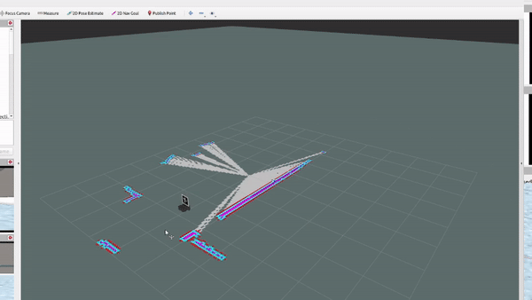
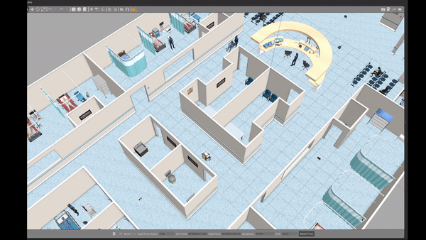
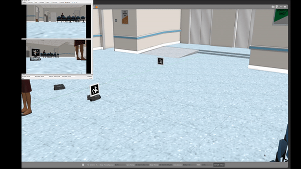
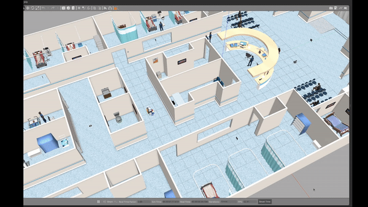
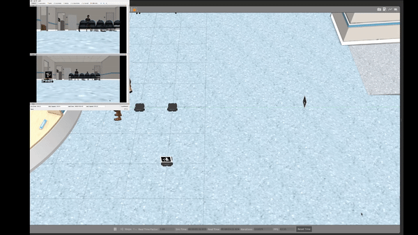
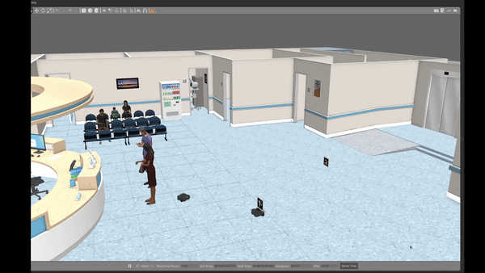

# Robile Mobotics

EECE 5550 Mobile Robotics  
Mohammadreza Sharif

[Presentation Slides](https://docs.google.com/presentation/d/1x9Tu-_SV50ZAwUNCYjKCzSsZkwlb8trtLRvWVC54Z8I/edit#slide=id.p)

## Setup

```bash
cd ~
git clone git@github.com:sharif1093/apriltag_gazebo_model_generator.git
cd ~/apriltag_gazebo_model_generator/ar_tags/scripts
./generate_markers_model.py -i ../36h11_sample -s 200 -w 50
```

```bash
echo "export TURTLEBOT3_MODEL=waffle" >> ~/.bashrc
sudo apt install ros-noetic-turtlebot3-msgs ros-noetic-image-transport-plugins
sudo apt-get install imagemagick
```

```bash
git submodule update --init --recursive
```

Additional ROS packages:

``` bash
sudo apt install ros-noetic-gmapping ros-noetic-map-server ros-noetic-amcl ros-noetic-move-base ros-noetic-dwa-local-planner
```

Add explore_lite but exclude multrobot_map_merge
```
catkin config --blacklist multirobot_map_merge
```
To support pose to quaternion transforms in RobotMaster.py and RobotSlave.py with scipy:
```
pip3 install scipy
```

## Build
From the root of this repository run:  
``` bash
catkin build
```  

## Task 1: SLAM  
### Run  
``` bash
roslaunch guide_robot start.launch slam:=true autonomous:=true
```  
Save the map:  
``` bash
rosrun map_server map_saver -f src/guide_robot/maps/hospital
```
### Videos  
Autonomous SLAM:  
  

## Task 2: Navigation and SOIs  
### Run  
``` bash
roslaunch guide_robot start.launch
```  
Send master to tags 0, 1, and 2:
``` bash
rostopic pub /target std_msgs/String "data: '0,1,2'"
```  
### Videos
Move to tag 0, tag 1, and tag 2:  
  

## Task 3: Guidance  
### Run  
``` bash
roslaunch guide_robot start.launch
```  
Guide slave 0 to tag 0:  
``` bash
rostopic pub /follow std_msgs/String "data: '0,0'"
```  
### Videos  
Follow to close tag:  
  
Follow to far tag:  
  

## Task 4: Multi-Robot Guidance & Disinfection
### Run  
``` bash
roslaunch guide_robot start.launch multi:=true
```  
Guide slave 0 to tag 0 then slave 1 to tag 0:
``` bash
rostopic pub /follow std_msgs/String "data: '0,0 1,0'"
```  
### Videos  
Multi-robot following:  
  
Cleaning task:  
  

## Resources
[Robotis Tutorials](https://emanual.robotis.com/docs/en/platform/turtlebot3/slam/)  
[AWS HospitalWorld Blog Post](https://aws.amazon.com/blogs/robotics/hospital-world-simulating-robot/)  
[move_base params: ROS navigation wiki](http://wiki.ros.org/navigation/Tutorials/RobotSetup)
